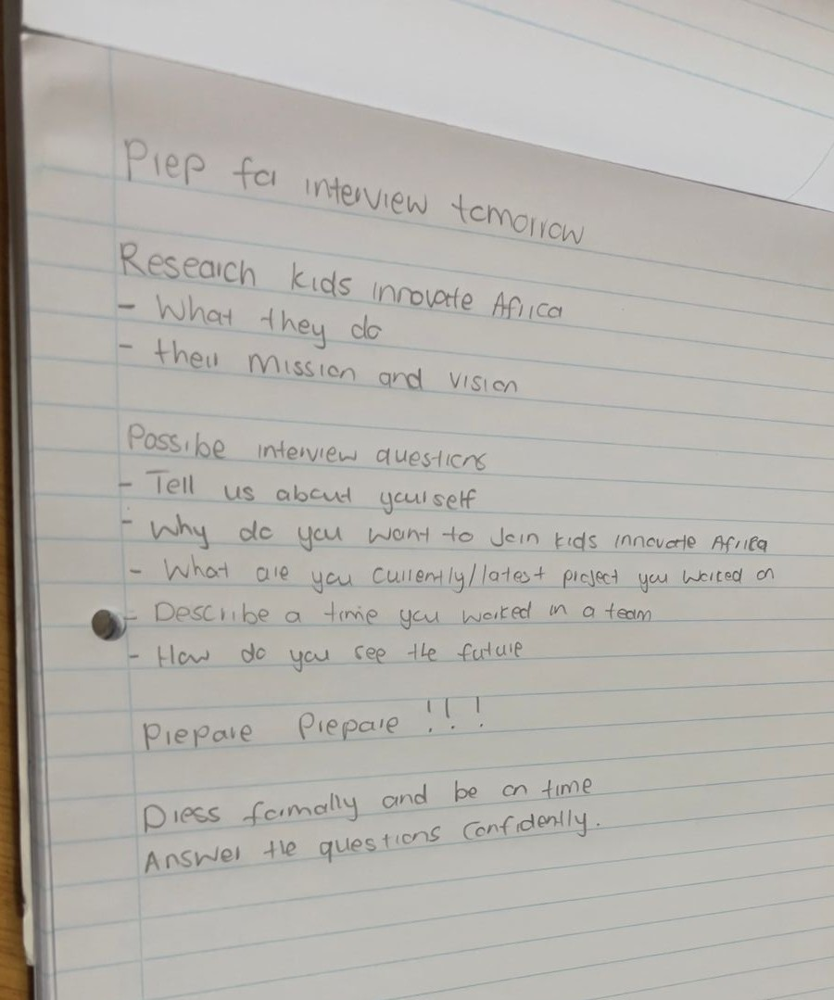
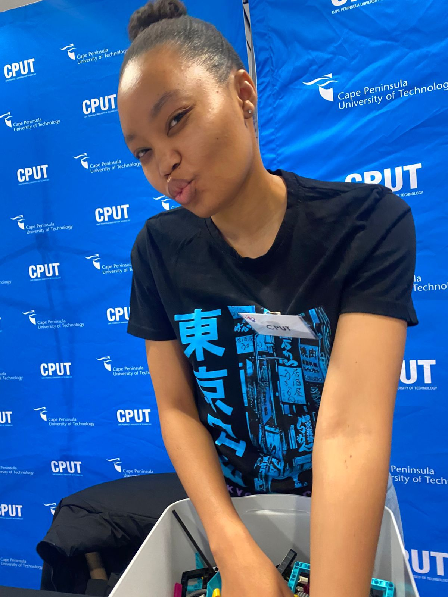
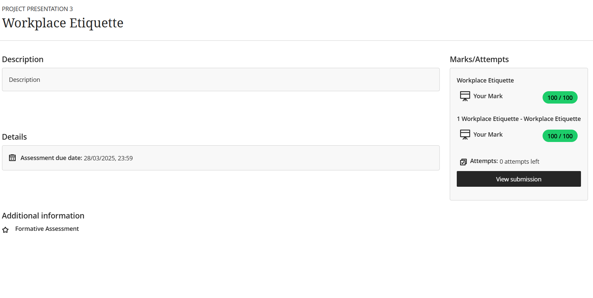

# digitalPortfolio-Work-readiness

Welcome to my Digital Portfolio for the Work Readiness Training at the Cape Peninsula University of Technology (CPUT).
This portfolio showcases the skills, knowledge, and growth I achieved through the training program. It includes artefacts (evidence) and reflections written using the STAR (Situation, Task, Action, Result) technique.
The following sections demonstrate my progress across the five key focus areas:

-Business Communication  
-Interview Skills  
-Mock Interview  
-Professional Networking  
-Workplace Etiquette  

**BUSINESS COMMUNICATION**

## _Evidence_
-Business formal email of confirming an interview

## Reflection: STAR Technique
**Situation (S):** At a technology networking event, I met a professional who invited me to attend an interview for a potential internship.  

**Task (T):** I needed to write a professional email confirming the interview and attach my CV in a clear and polite manner.  

**Action (A):** I drafted the email carefully, ensuring a professional tone, proper greeting, clear confirmation of the interview details, and included my CV as an attachment. I reviewed the email to make sure it was concise, polite, and error-free before sending it.  

**Result (R):** The professional responded positively, acknowledging receipt of my email and CV. This experience enhanced my confidence in professional written communication and taught me how to effectively correspond with potential employers.

**INTERVIEW SKILLS**

## _Evidence_
-Interview Preparation

 ### Reflection: STAR Reflection 
**Situation (S):** I had an interview with Kids Innovate Africa for an internship. 

**Task (T):** I needed to prepare effectively to make a strong impression.  

**Action (A):** I created a checklist, researched the organization, prepared a personal intro, practiced STAR answers, and thought of questions to ask the interviewer.  

**Result (R):** The interviewer was impressed, and I was offered an internship on the spot.

**MOCK INTERVIEW**

## _Evidence_

-Mock Video
[Watch Mock Interview Video](./MockVid.mp4)

 ## Reflection: STAR Technique
**Situation (S):** As part of the Work Readiness Training, we participated in a mock interview to simulate a real professional interview.  

**Task (T):** I needed to answer questions confidently, demonstrate professionalism, and apply what I had learned during preparation.  

**Action (A):** I practiced responses using the STAR method, maintained good posture and eye contact, and received feedback from facilitators and peers.  

**Result (R):** The mock interview helped me identify strengths and areas to improve, boosting my confidence and readiness for real interviews.

**PROFESSIONAL NETWORKING**
## _Evidence_

-Woolworths Women in tech event

## Reflection: STAR Technique
**Situation (S):** I attended the Woolworth Women in Tech event to assist one of my lecturers and learn more about professional networking.  

**Task (T):** I aimed to engage with industry professionals, make meaningful connections, and observe networking in a professional setting.  

**Action (A):** I introduced myself to attendees, asked questions about their roles and experiences, exchanged contact information, and assisted my lecturer with event tasks.  

**Result (R):** Through networking at this event, I connected with a representative from Kids Innovate Africa, which directly led to being invited for an internship interview. This experience showed me the power of networking and made me more confident in approaching professionals.

**WORKPLACE ETIQUETTE**
## Evidence

-Training in project presentation module

## Reflection: STAR Technique
**Situation (S):** As part of the Work Readiness Training, I completed a Workplace Etiquette module and assessment.  

**Task (T):** I needed to understand professional behavior and demonstrate my knowledge by completing the test.  

**Action (A):** I studied the module carefully, learned about professional communication, teamwork, punctuality, and workplace norms, and applied these lessons in the test.  

**Result (R):** I scored 100% on the Workplace Etiquette test, showing that I fully understood professional expectations and am ready to apply them in real workplace situations.

